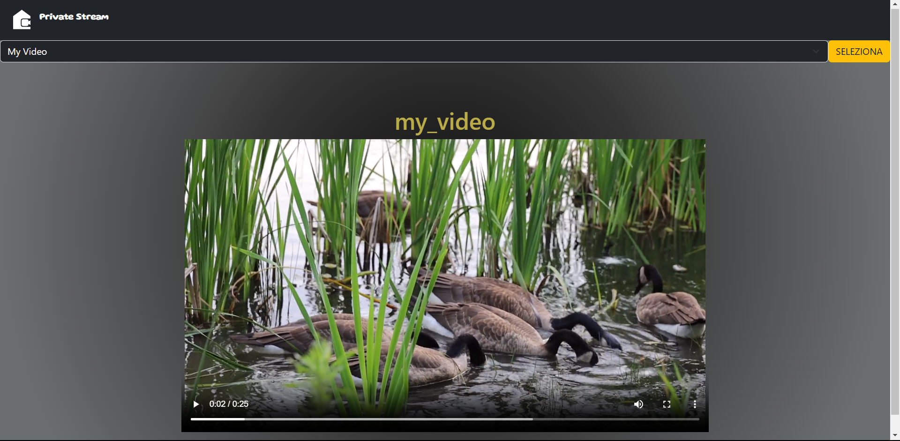

# Private Stream

This software is a simple streaming platform where the user can upload their movie or videos on their server.  
  
I know that online you can find best alternatives to this, but i programmed this software especially to train my coding skills at server side.

# How to upload video on the server

To upload your video on the platform you must do two simple step:

* Copy your video in the directory `static/videos`

* Add the metadata of your video into the JSON file `static/JSON/media.json`, for example if you want to upload your movie `Titanic.mp4`, open the JSON file and add this row:

```JSON
[
    {"id":"Titanic", "title":"Titanic.mp4"}
]
```

for each video you need to add a line and all lines *(movies)* must be in the square brackets.

# How to execute

To execute the web app you must run the server written with the ***python flask*** with *python interpreter*, so open the terminal and insert this command:

```shell
python app.py
```

after the server started open your browser and insert `<your_IP>:5000`.

# Used Technologies

* HTML
* CSS
* Bootsrap
* JSON
* Python
* Flask

# Dependencis

The main framework of the web application is flask so you must install the *flask framework* with:

```shell
pip install flask
```

# How to use

Choose your video or movie into the menù and watch your video.



⚠: The "SELEZIONA" button showed into the screen has been removed with a patch.

# Developer

Emilio Garzia
